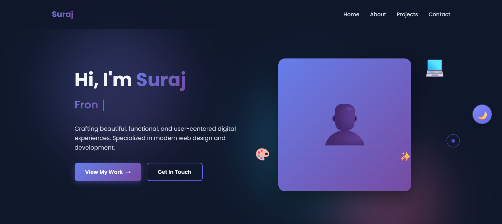
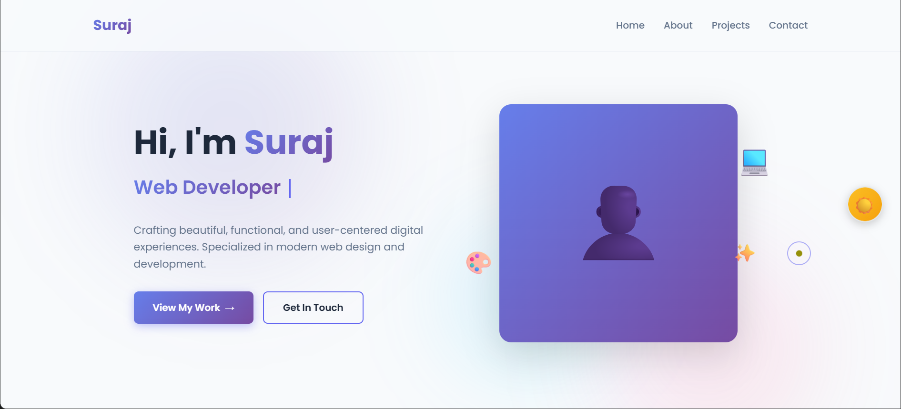

# 🎨 Suraj's Portfolio Website

A modern, fully responsive portfolio website showcasing UI/UX design and web development projects. Built with pure HTML5, CSS3, and vanilla JavaScript featuring stunning dark/light mode, custom cursor animations, smooth scroll effects, and a complete suite of professional pages.

## 🌐 Live Demo

**[View Live Website →](https://surajkrsingh-ind.github.io/portfolio)**

Replace with your actual deployment URL after hosting!

---

## ✨ Features

### 🎯 Core Features
- 🌓 **Dark/Light Mode Toggle** - Smooth theme switching with localStorage persistence
- 🖱️ **Custom Cursor** - Interactive cursor with fluid animations and hover effects
- 📱 **Fully Responsive** - Optimized for all devices (mobile, tablet, desktop)
- 🎭 **Animated Background** - Dynamic gradient blobs with floating animations
- ⚡ **Performance Optimized** - Fast loading with minimal dependencies
- 🎨 **Modern UI/UX** - Clean design with smooth transitions and micro-interactions

### 📄 Complete Pages
- 🏠 **Homepage** - Portfolio overview with hero section, skills showcase, and featured projects
- 👨‍💻 **About Page** - Detailed journey timeline, skills breakdown, and personal values
- 📧 **Contact Page** - Working contact form with multiple contact methods
- 🔒 **Privacy Policy** - GDPR-compliant privacy documentation
- 📜 **Terms & Conditions** - Comprehensive usage terms
- 🗺️ **Sitemap** - Both HTML (visual) and XML (SEO) sitemaps

### 🚀 Technical Features
- 📧 **Working Contact Form** - Integrated with Web3Forms (unlimited free submissions)
- 🔍 **SEO Optimized** - Meta tags, semantic HTML, and XML sitemap
- ♿ **Accessible** - ARIA labels and keyboard navigation
- 🎯 **No Dependencies** - Pure vanilla JavaScript (no frameworks)
- 💾 **Theme Persistence** - Remembers user's theme preference
- 🔐 **Spam Protection** - Honeypot field in contact form

---

## 📸 Screenshots

### Homepage - Dark Mode

### Homepage - Light Mode

### About Page

### Contact Page

### Mobile Responsive

---

## 🛠️ Built With

| Technology | Purpose |
|------------|---------|
| **HTML5** | Semantic markup structure |
| **CSS3** | Modern styling (Variables, Flexbox, Grid) |
| **JavaScript (ES6+)** | Interactive functionality |
| **Web3Forms** | Contact form backend |
| **Google Fonts** | Poppins font family |

### Why No Frameworks?
This project intentionally uses **zero frameworks or libraries** to demonstrate:
- ✅ Pure web development skills
- ✅ Understanding of core concepts
- ✅ Optimal performance
- ✅ Easy maintenance and customization

---

## 📋 Prerequisites

No build tools or dependencies required! You just need:

- ✅ A modern web browser (Chrome, Firefox, Safari, Edge)
- ✅ A code editor (VS Code recommended)
- ✅ Basic knowledge of HTML, CSS, and JavaScript
- ✅ Optional: Git for version control

---

## 🚀 Quick Start

### 1. Clone the Repository

### 2. Open in Browser

**Option A: Using Live Server (Recommended)**

**Option B: Direct Open**

### 3. Start Editing!

No compilation or build process needed. Edit HTML/CSS/JS files and refresh your browser to see changes.

---

## ⚙️ Configuration Guide

### 🔧 Step 1: Update Personal Information

#### In ALL HTML files (index.html, about.html, contact.html, etc.), replace:

**Personal Details:**

### 📧 Step 2: Setup Contact Form (Web3Forms)

1. **Get Your API Key:**
   - Visit [Web3Forms.com](https://web3forms.com)
   - Enter your email address
   - Click "Get Access Key"
   - Check your email for the API key

2. **Update contact.html:**
